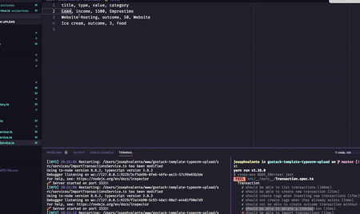

<h1 align="center">
 
  
 
 
Gestão de Transição
</h1>

Banco de dados e upload de arquivos no Node.js

  

[//]: # (Add your gifs/images here:)

  

## Descrição

Nesse desafio, desenvolvi uma a aplicação de gestão de transações,treinando o que aprendi até agora no Node.js junto ao TypeScript, mas dessa vez inclui o uso de banco de dados com o TypeORM e envio de arquivos com o Multer!

Essa é uma aplicação para armazenar transações financeiras de entrada e saída e permitir o cadastro e a listagem dessas transações, além de permitir a criação de novos registros no banco de dados a partir do envio de um arquivo csv.

## RECURSOS
[//]: # (Add the features of your project here:)

- nodeJS
- TypeScript
- Docker
- TypeORM
- Insomnia
- Multer
- PostgreSQL
- JWT

## Iniciando a aplicação

 - Clone o arquivo no seu terminal `git clone https://github.com/PyDecco/typeorm-upload`
 - Vá até o diretorio instalado e digite `cd typeorm-upload`
 - Digite `yarn` para baixar os pacotes

## License

This project is licensed under the MIT License - see the [LICENSE](https://opensource.org/licenses/MIT) page for details.
